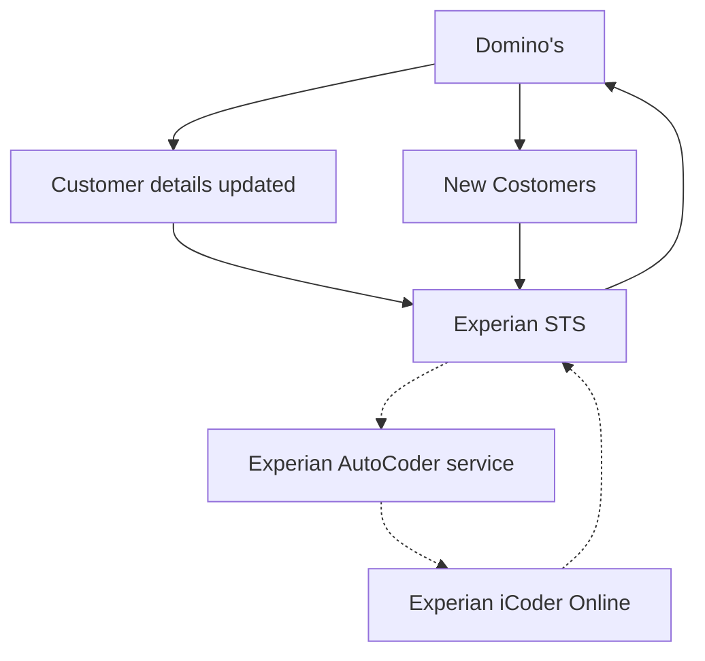
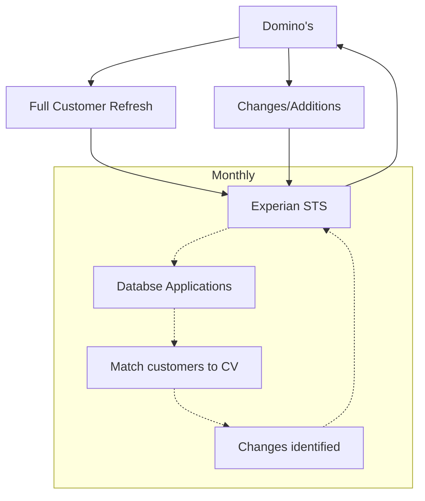

```mermaid
graph TB
    d[Domino's]-->u1[Customer details updated]    
    d-->u2[New Costomers]
    u1-->e1[Experian STS]
    u2-->e1
    e1-.->ea[Experian AutoCoder service]-.->eio[Experian iCoder Online]-.->e1-->d
```

```mermaid
graph TB
  

    d[Domino's]-->u1[Full Customer Refresh]-->e1[Experian STS]-.->e3
    d-->u2[Changes/Additions]-->e1
    
    subgraph Monthly
    e3[Databse Applications]-.->p1[Match customers to CV]
    p1-.->p2[Changes identified]-.->e1
    end
    e1-->d

```